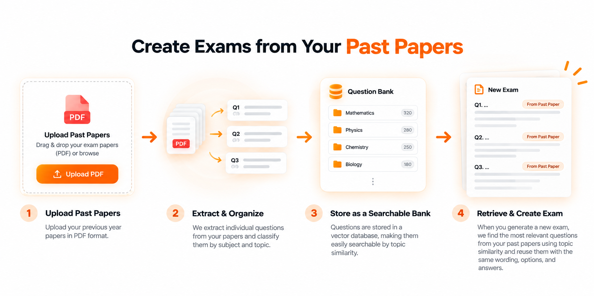
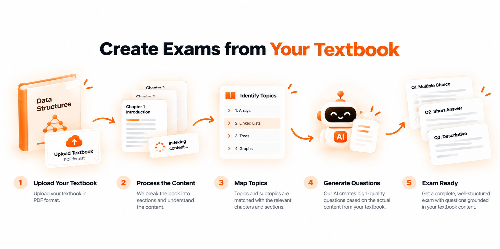
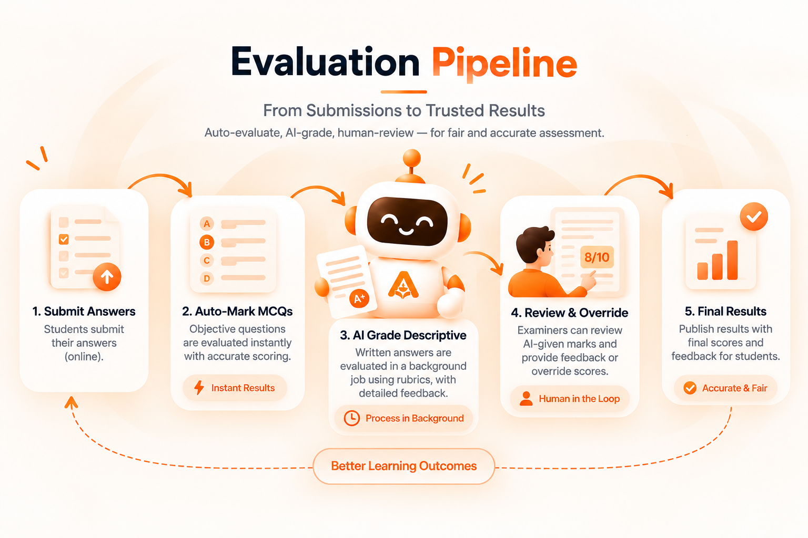

# Abhyas

**Practice Today. Perform Tomorrow.**

Abhyas is an AI-powered exam platform that lets educators create, deliver, and grade exams in minutes instead of hours. Writing a good exam from scratch and grading a stack of descriptive answers afterward both eat enormous amounts of an educator's time — Abhyas collapses both ends of that process into four purpose-built AI agents, wrapped in a full role-based platform (admin / examiner / candidate) for actually running the exam end to end.

<p align="center">
  
</p>

## The Four Agents

Each agent is named after a Sanskrit word describing what it does — the same linguistic family as "Abhyas" (अभ्यास, disciplined practice) itself.

### Srijan (सृजन — creation)

No source material needed. Describe the exam you want — subject, topics, difficulty, question count — and the agent plans a topic/subtopic blueprint, generates every question against it, and verifies MCQ answers before saving.


### Smriti (स्मृति — memory)

Upload previous-year question papers once. Each paper is extracted, split into individual questions with their options, answer keys, tables and images, classified by subject/topic, and embedded into a searchable bank — so future exams can pull matching questions back out via semantic search instead of writing them again.



### Gyan (ज्ञान — knowledge)

Upload a textbook once. It's indexed into a hierarchical chapter/section structure with generated summaries, and new questions are generated grounded in that book's actual content — matched by citation rather than embeddings, so every question traces back to real source material instead of the model's general knowledge.



### Nirnay (निर्णय — judgment)

Once a candidate submits, MCQs are auto-marked instantly. Written answers are graded by AI against a rubric with category-wise scoring and personalized feedback — behind a guardrail agent that screens every submission for prompt-injection before it's evaluated — and every AI-given mark stays reviewable and overridable by the examiner before results are released.



## How it fits together

- **Three roles**: admins manage users, roles, and platform settings; examiners create, publish, and grade exams; candidates join and take them.
- **Background jobs, not blocking requests**: all four agents run as [Inngest](https://www.inngest.com/) functions, so a long job (indexing a 300-page textbook, generating a full exam) doesn't hang the UI and automatically retries on failure.
- **Bring your own key**: examiners can use their own OpenAI key — encrypted at rest with AES-256 — instead of a shared platform key, so cost and usage stay in their control.
- **Structured, validated outputs**: every agent call returns schema-validated JSON (via Zod) rather than free text that has to be parsed and hoped for.

## Tech stack

| Layer | Stack |
|---|---|
| Frontend | React 19, Vite, TypeScript, Tailwind CSS, shadcn/ui (Base UI), React Router, Clerk |
| Backend | Node.js, Express, TypeScript, Drizzle ORM |
| Database | PostgreSQL |
| Background jobs | Inngest |
| Vector search | Qdrant |
| AI providers | OpenAI SDK, Mistral AI (bring-your-own-key per examiner, with a platform fallback) |
| File storage | Cloudinary |
| PDF extraction | PyMuPDF (Python subprocess) |

### Deployment

- **Frontend** — [AWS Amplify Hosting](https://aws.amazon.com/amplify/), built and deployed automatically from this repo.
- **Backend** — Dockerized and run on [Amazon EC2](https://aws.amazon.com/ec2/) (chosen over serverless because the PDF-extraction pipeline shells out to a Python subprocess), image stored in [Amazon ECR](https://aws.amazon.com/ecr/).
- **Database** — [Amazon RDS for PostgreSQL](https://aws.amazon.com/rds/postgresql/).

## Project structure

```
abhyaslm/
├── client/           # React + Vite frontend
│   ├── public/        # Static assets, including the pipeline images above
│   └── src/
│       ├── pages/      # Route-level pages
│       ├── components/ # Shared UI components
│       └── lib/        # API client, hooks, types
├── server/           # Express + TypeScript backend
│   ├── src/
│   │   ├── module/      # One folder per domain (generation_agents, exams, books, question_bank, users, settings, evaluation)
│   │   └── common/       # Shared infra: db, auth, agent clients, PDF bridge, utils
│   ├── drizzle/          # SQL migrations
│   └── python/            # PyMuPDF extraction scripts
└── docker-compose.yml # Local Postgres + Qdrant for development
```

## Getting started

### Prerequisites

- Node.js 20+
- Docker (for local Postgres/Qdrant)
- Python 3 with `PyMuPDF` installed (`pip install -r server/python/pdf_extractor/requirements.txt`)
- A [Clerk](https://clerk.com/) application (for auth)
- An OpenAI and/or Mistral API key

### 1. Start local services

```bash
docker compose up -d
```

### 2. Backend

```bash
cd server
npm install
cp .env.example .env   # fill in DATABASE_URL, CLERK_*, ENCRYPTION_KEY, etc.
npm run db:migrate
npm run dev              # runs the API + Inngest dev server together
```

### 3. Frontend

```bash
cd client
npm install
cp .env.local.example .env.local   # fill in VITE_CLERK_PUBLISHABLE_KEY
npm run dev
```

The frontend runs at `http://localhost:3000` and proxies `/api` to the backend at `http://localhost:8000`.

### Environment variables (backend)

| Variable | Required | Notes |
|---|---|---|
| `DATABASE_URL` | Yes | Postgres connection string |
| `CLERK_SECRET_KEY` / `CLERK_PUBLISHABLE_KEY` | Yes | From your Clerk dashboard |
| `ENCRYPTION_KEY` | Yes | Any random string — encrypts examiners' own API keys at rest |
| `FRONTEND_URL` | No | Comma-separated allowed origins for CORS/Clerk (defaults to `http://localhost:3000`) |
| `CLOUDINARY_CLOUD_NAME` / key / secret | No | For file uploads |
| `QDRANT_URL` / `QDRANT_API_KEY` | No | Defaults to local Qdrant from `docker-compose.yml` |
| `OPENAI_API_KEY` / `MISTRAL_API_KEY` | No | Platform fallback key, used when an examiner hasn't set their own |
| `INNGEST_SIGNING_KEY` / `INNGEST_EVENT_KEY` | No | Required in production; omit locally to use the Inngest dev server |
| `ADMIN_EMAILS` | No | Comma-separated emails that become admins on first sign-in |

## License

MIT
